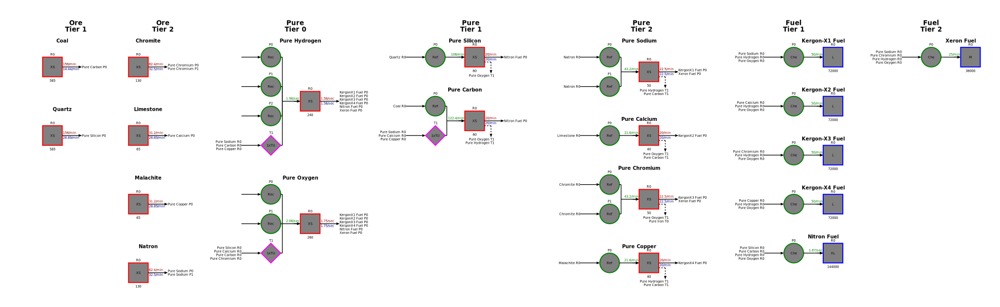

# Dual Universe Factory Generator

Use the application here: https://thearchitectio.github.io/du-factory-generator/

This is an application for generating a factory plan for [Dual
Universe](https://www.dualuniverse.game/). Given a set of items, the
number of assemblers producing each item, and the quantity to maintain
in the output containers, this tool will generate a full production
line from ores to the requested items. The designed factory plan will
ensure that all production rates are satisfied, so that the factory
will run at full capacity. Each item type is stored in an individual
container so that factory monitor scripts can monitor their contents.
Here is an example factory plan, where we produce each type of fuel:



[Load the
application]() and
click "Help Information" for information about using this tool.

### Prerequisites

[NodeJS](https://nodejs.org/en/)

### Install Dependencies and Build

```bash
$ npm install
$ npm run build
```

### Launch Development Server

```bash
$ npm start
```

Navigate your browser to http://localhost:8080/

## License

Dual Universe Factory Generator is licensed under the MIT License.
See [LICENSE](./LICENSE)
